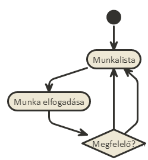
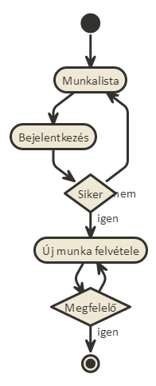
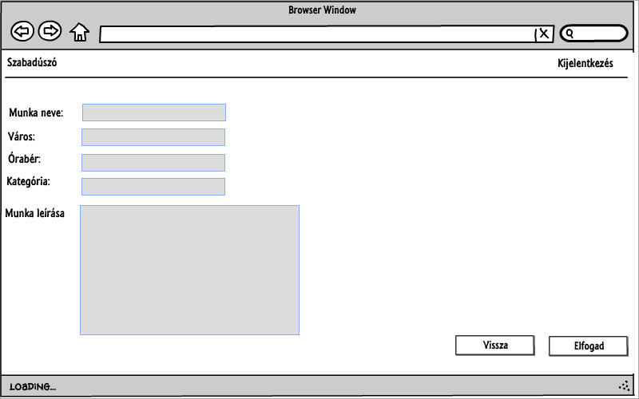
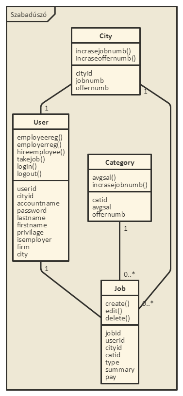
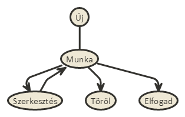

# Beadando
<h1>Alkalmazások fejlesztése első beadandó</h1>

<h3>Késíztette: Lévai András</h3>
<h5>Nemptun: AGY276</h5>
<h5>email: levaiandrass@gmail.com</h5>

### __Követelmény__ __analízis__

###### 1. Funkcionális és nem funkcionális elvárások
        Alkalmazások fejlesztése órára egy olyan programot kellett készíteni mely a node js-t 
    felhasználva képes adatokat tárolni, új adatokat felvinni, meglévőket szerkeszteni 
    vagy törölni azokat. 
        Elvárás volt még egy autentikációs folyamat is, melyben egy regisztrált személy
    csak akkor haszánlhatja  programot/léphet be az oldalra, ha adatai megfelelnek
    és szerepel az adatbázisban.
        Nem funkcionális elvárás jelszavak hashelése és minnél egyszerűbb oldaltérkép, 
    azaz, hogy a felhasználónak ne kelljen túl mélyen bejárnia az oldalt egyes funkciók 
    eléréséhez.

###### 2. Szakterületi fogalomjegyzék
        Munka: Típusa, órabér megadása, település és kategória regisztrációja a könyebb
    beazonosítás végett.
        Település: Minden munkához és munkaadóhoz tartozik egy kötelezően megadott település
    ahol a munkát kell végezni, vagy ahol a munkáltató tartózkodik. A munkavállalónak ez csak 
    opcionálisan kell megadnia.
        Kategória: Tömören, maximum 3 szóban összefoglalva a munka mivoltját, hogy egyszerűbben
    meg lehessen különböztetni egymástól őket. Vannak adott, előre megadott kategóriák, de ha azokba
    a felhasználó úgy érzi nem tartozik bele a munka, úgy egy sajátot is megadhat.

###### 3. Használatieset-modell
        i. Szerepkörök : Két fajta felhasználó a munkaadó és a munkaválalló, szerepkörüket
    tekintve a munkavállaló jobban lekorlátozott az alkalmazás funkciójaival szemben.
    (Emellett a harmadik szerepkör a vendég aki még nem jelentkezett be, de neki csak a munkák
    megtekintésére van lehetősége, így nem is tekinthető igazi felhasználónak.)
    
        ii. Használati útmutató a két felhasználó modellhez:  Az alkalmazásban két fajta
    felhasználó elérhető, a munkaadó és a munkavállaló.
    A munkaválallók lehetőségei korlátozzok, nekik csak meghirdetett munkák megtekin-
    tésére és azokra való jelentkezésre van lehetőségük (ha a munka szabad). A munka-
    adó ezzel ellentétben felvehet új munkát, szerkesztheti, törölheti azokat és el is
    fogadhatja, ha egy munkavállaló jelentkezett a munkára. Ennél a modellnél mindösz-
    sze annyi megkötés van, hogy nem fogadhat el munkát valamint más munkaadó feladott
    munkáját értelem szerűen nem szerkesztheti/törölheti.

    
        iii. Folyamat diagramm és a Munkavállaló modell kifejtése.
    A bejelnetkezés oldalra érkezve eldönthetjük milyen típusú felhasználót szeretnénk 
    regisztrálni. Jelen esetben vegyük a munkavállalót, hiszen ő kevésbé lekorlátozott
    szerepkört tölt be. A regisztrációs oldalon meg kell adnunk vezeték és keresztnevünk
    , felhasznlói nevünk, jelszót, valamint lehetőségünk van céget és várost megadni, de
    ezeket az alkalmazás nem várja el, így üresen is hagyhatjuk őket, ha szereretnénk.
    Regisztráció után, sikeres bejelentkezéssel a feladott munkák listája fogad minket.
    Itt a bal alsó sarokban található gombal felvehetünk egy új munkát. Ezután átkerülünk
    a munka felvételének az oldalára. Itt meg kell adnunk kötelező módon a várost amely-
    ben a munkát hirdetjük, a típusát (például fizikai vagy irodai), egy rövid leírását
    és az órabért. Ha ezt sikeresen megadtuk ismét visszakerülünk a munkák listáját meg-
    jelenítő oldalra, ahol már meg fog jelenni az imént felvett munkánk is. Ez után lehe-
    tőségünk lesz szerkeszteni vagy törölni a feladott munkát. Törlés esetén az alkalmazás 
    egyszerűen csak törli az adatbázisból az információkat. Szerkesztés esetén egy újabb
    oldalra jutunk, ahol a korábban feladott munka bármely tulajdonságát szabadon változ-
    tathatjuk (olyan megkötésekkel mint például, hogy az órabér csak szám lehet). Nem
    muszáj minden adatot módosítanunk vagy újra beírnunk csak azokat melyeket ténylegesen
    változtazni szeretnénk. A harmadik gomb akkor válik számunkra elérhetővé, ha egy 
    munkavállaló jelentkezett egy munkára. Ezután mi elfogadhatjuk ezt és így a munka
    betöltötté válik.

        i. Munka elfogadásának menete    

        ii. Új munka felvételének menete

### __Tervezés__

##### 1.Architektúra terv
    i. Oldaltérkép
            Publikus:
                - Főoldal
                    + Munkalista
                - Regisztráció
                - Bejelentkezés
            Munkaválalló
                - Főoldal
                    + Munkalista
                - Bejelentkezés/Kijlentkezés
                - Munkalista
                - Munka elfogadása
            Munkaadó
                - Főoldal
                    + Munkalista
                - Bejelentkezés/Kijlentkezés
                - Új munka felvételez
                - Felvett munka szerkesztése
                - Felvett munka törlése
                - Munkaadó jelentkezésének elfogadása
                
    ii. Végpontok
            * POST /: Főoldal
            * GET /signup: Átirányítás munkaadó regisztrációs oldalra
            * POST /signup: Munkaadó regisztráció ellenőrzés és mentése
            * GET /signupemp: Átirányítás munkavállaló regisztrációs oldalra
            * POST /signupemp: Munkavállaló regisztrácó ellenőrzése és mentése
            * GET /munkalista: Munkák listájának a megjelenítése
            * POST /munkalista: Kiemelt munka szerkesztési oldalára irányít át
            * POST /elfogad: Munkavállaló regisztrálása egy betöltetnen munkáhozz
            * POST /torol: Kijelölt munka törlése
            * GET /felvesz: Új munka felvételéne az oldalára átirányítás
            * POST /felvesz: Új munka felvétele és adatok ellenőrzése
            * GET /szerkeszt: Munka szerkesztési oldalának a megjelenítése
            * POST /szerkeszt: Szerkesztett munka mentése
            * GET /delete: Munka törlése
            * GET /jovahagy: Munkavállaló jelentkezésének elfogadása
            
##### 2. Felhasználói felület modell
    i. Munkalista vázlat

    ii. Munka szerkesztése

         
##### 3.Osztálymodell
    i. Adat modell:

    
    ii. Állapot diagramm:

##### 4. Javascript, 2. Beadandó

    1. Folyamatok

        i. Munka elfogadása: A munka elfogadását csak alkalmazotti státuszú felhasználó teheti meg. Az elfogad gombra kattintva egy Ajax hívást intézünk a "/job/:id/take" route-ra, amely
        a controller "doTake" funkcióját futtatja le és regisztrálja a munkaválallót a munkához. Ezután frissíti a táblázatot.

        ii. Munka törlése: A munka törlését csak munkaadó és azon belül is csak az teheti meg, aki a munkát létrehozta. Az elfogadáshoz hasonlóan itt is egy ajax hívás történik a "/job/:id/delete"
        route-re, ami a controller "doDelete" funkcióját hívja meg, majd frissíi a táblázatot.

        iii. A táblázat felett elhelyezett bal oldali gomb segítségével választani tudunk, melyik városokból szeretnénk a munkákat látni. Ehhez egy ajax hívást végzünk, az "/ajaxCategoryFilter/:choosenCategory?'"-ra
        amely paraméterül az adott város id-jét kapja és állít be egy globális filtert a városokra, amely aztán a táblázat elkészítéséhez felelős "main" függvényen keresztül, kiválasztja azon
        munkákat melyek az adott városokba tartoznak. Az "Összes" opcióval visszatérhetünk az alapállapotra, és az összes város munkáit láthatjuk.

        iv. A táblázat felett elhelyezett jobb oldali gomb segítségével választani tudunk, melyik kategóriából szeretnénk a munkákat látni. Ez is, mint a város filterelése egy saját "'/ajaxCityFilter/:choosenCity?'"
        route-on keresztül végzi az ajax hívást, állít be egy globális változót és frissíti a "main" függyvényben lekért munkákat az alapján, milyen filtert állítottunk be. A két szűrés egyszerre is
        működik, így ki tudunk választani várost és kategóriát egyszerre.

        v. Az egyes munkáknál elhelyezz kategória típusokra kattintva egy statisztikát kaphatunk felugró ablakba, hogy hány munka van meghirdetve az adott kategóriában összsen.

        vi. A munkák város tulajdonságánál pedig a munkákra kaphatunk egy hasonló statisztikát.

    2. Fájlok és módosítások

        i. A javascript funkciók a public/js/main.js fájlban találhatók
            -selectCity() --> a város szűrése
            -selectCategory() --> a kategória szűrése
            -deleteJob() --> munka törlése
            -acceptJob() --> munka elfoadása
            -getCategoryStats() --> kategória statisztikák kiiratása
            -getCityStats() --> város statisztikák kiiratása

        ii. A route-ok az app/Http/route.js fájlban lettek regisztrálva

        iii. Az "ajaxCategoryFilter" és "ajaxCityFilter" funkciók a JobsControllerbe találhatók

    3. Szekvenciális Diagramm a város szűréshez

    